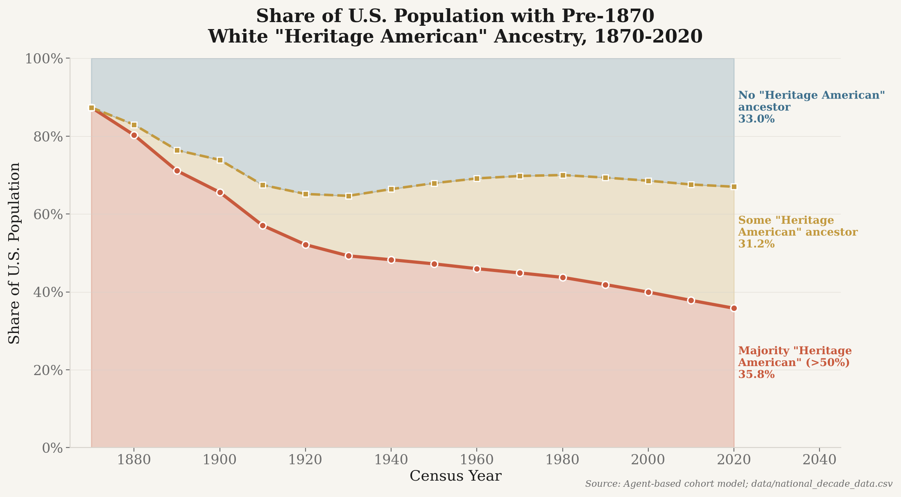
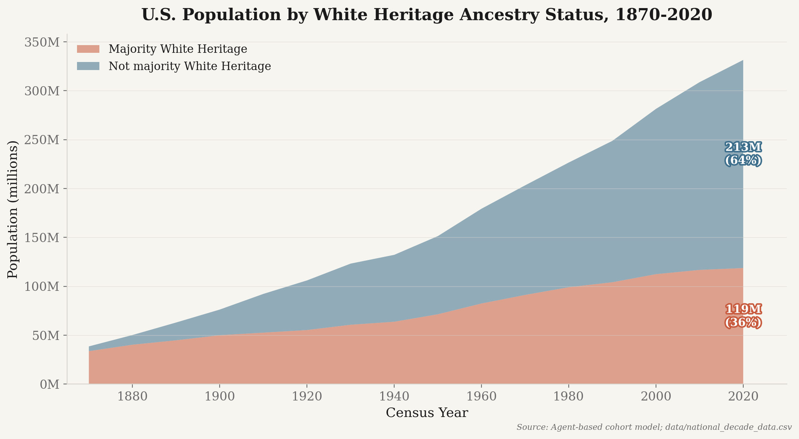
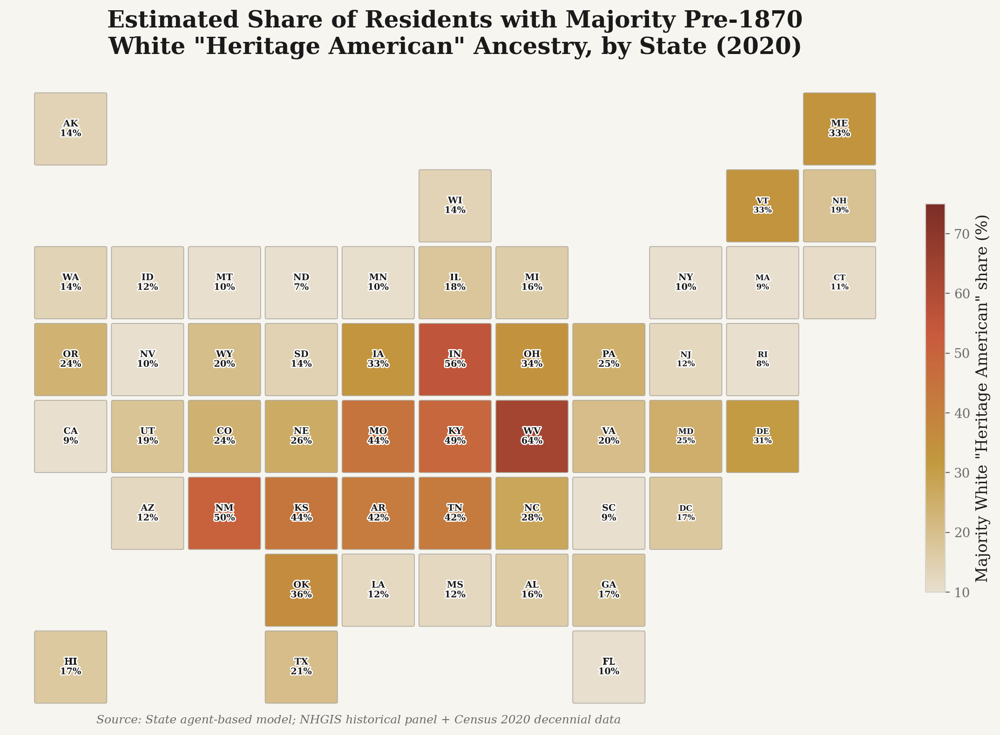
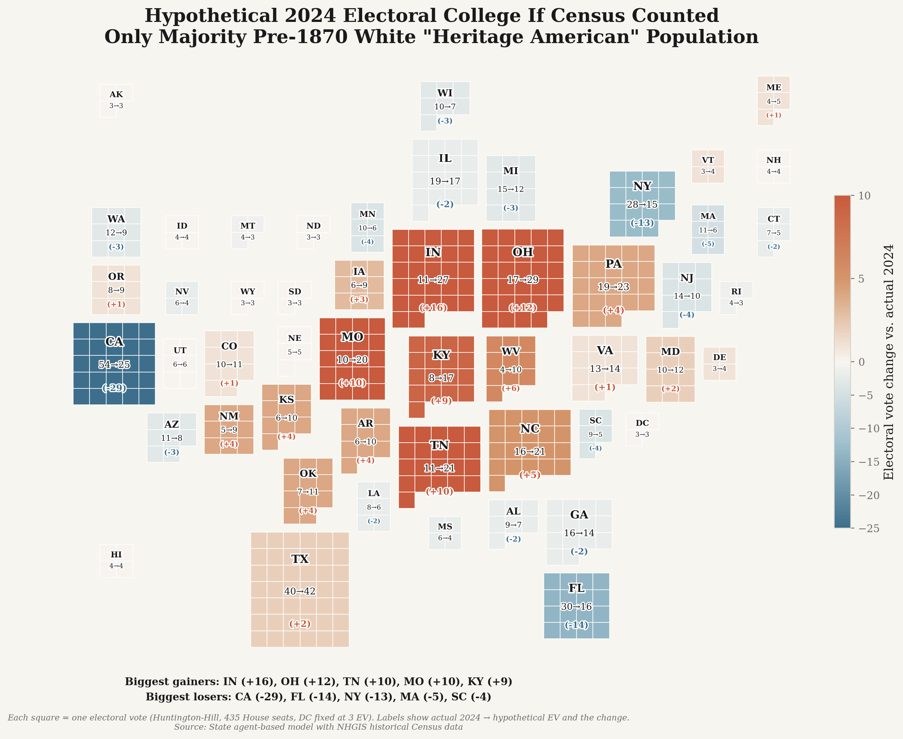
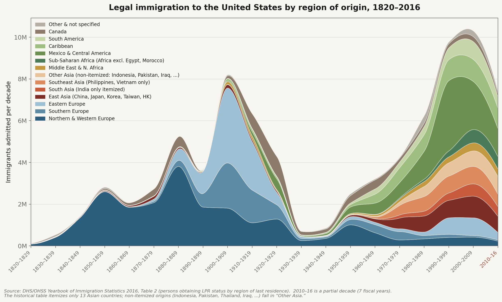
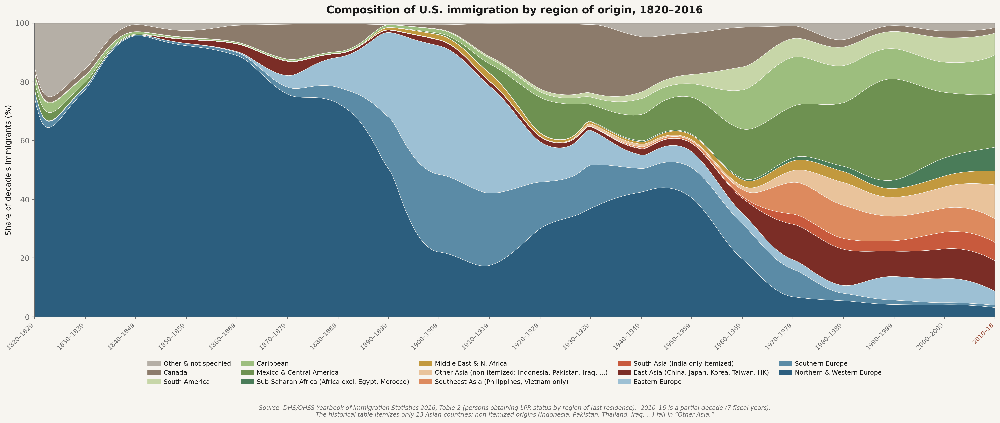
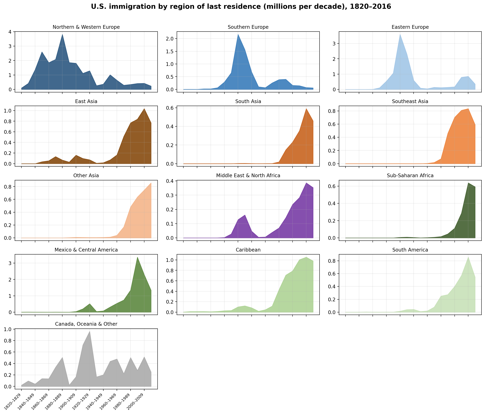

# Pre-1870 White Heritage American Ancestry Model and Electoral College Reapportionment

This package estimates what share of each U.S. state's current population descends from White residents living in the United States before 1870, then asks: **what would the Electoral College look like if the census counted only that population?**

The model is a counterfactual apportionment exercise. It does not predict how anyone would vote.

## Key findings (2020)

- **~21%** of the U.S. population has *majority* (>50%) pre-1870 White Heritage ancestry; **~56%** has *any* pre-1870 White ancestor.
- Rebased to the nonblack population (mass basis), **~31%** traces to the pre-1870 White stock — matching the Manhattan Institute's independent cohort-component estimate of ~31% pre-1860 nonblack ([Lehman, 2023](https://manhattan.institute/article/who-pays-for-reparations-the-immigration-challenge-in-the-reparations-debate)). The two methods converge once both use the cited native-vs-immigrant fertility differential.
- Hypothetical 2024 Electoral College (538 EV preserved): biggest losers **CA −30, NY −13, FL −13, MA −5, SC −4**; biggest gainers **IN +16, OH +11, MO +10, KY +9, TN +8**.

These figures use the cited per-decade foreign-born:native fertility differential
(`data/fertility_by_nativity.csv`, default on). Disabling it (`--no-native-fertility`,
unsourced constants) raises the majority share to ~35%. See [ASSUMPTIONS.md](ASSUMPTIONS.md).

## Key outputs

### Share of U.S. population with pre-1870 White Heritage American ancestry, 1870-2020



### U.S. population by White Heritage American ancestry status



### State-level White Heritage American ancestry share (agent-based model)



### Hypothetical Electoral College reapportionment



Each state is drawn as its own block of unit squares — **one square per electoral
vote** under the Heritage-American count — placed at its geographic position and
packed so no two states overlap. Blocks are colored by the **electoral-vote change**
versus actual 2024 (red = gains, blue = losses), and labeled with the state, its
**actual → hypothetical EV**, and the change. California collapses (54 → 24, −30) and
Florida (30 → 17) and New York (28 → 15) shrink sharply, while Indiana (11 → 27, +16),
Ohio (17 → 28, +11), Missouri (10 → 20, +10), Kentucky (8 → 17, +9), and Tennessee
(11 → 19, +8) expand.

### Legal immigration to the United States by region of origin, 1820-2016

Each chart has a companion explainer (data source, build steps, region
definitions, and verification): see
[`outputs/immigration_by_region_absolute.md`](outputs/immigration_by_region_absolute.md),
[`outputs/immigration_by_region_share.md`](outputs/immigration_by_region_share.md),
and
[`outputs/immigration_by_region_small_multiples.md`](outputs/immigration_by_region_small_multiples.md).







## State-level model

The qualifying ("White Heritage American") source stock is defined as residents
enumerated as **White** in the 1870 Census — Black, American Indian / Alaska
Native, and other non-white (e.g. Chinese) 1870 residents are excluded from the
qualifying stock but remain in the present-day denominator.

State-level estimates come from an **agent-based simulation**
(`state_agent_ancestry_model.py`): 1M agents are run through 1870-2020 using
historical Census data from NHGIS (population, race, and nativity by state per
decade). The 1870 qualifying stock is seeded from each state's enumerated
**White** share (excluding Black, AIAN, and other races); immigrant-descended
agents reproduce at the cited per-decade foreign-born:native fertility ratio
(`data/fertility_by_nativity.csv`). State differences emerge from the simulation
— there are no hand-set per-state factors. This is the method behind the headline
state map and EC cartogram.

## Data sources

All model inputs are loaded from CSV files in `data/`, not hardcoded:

| File | Source | Content |
|------|--------|---------|
| `national_decade_data.csv` | Census POP-WP056, DHS Yearbook, Haines, NCHS | National population, foreign-born share, TFR, LPR admissions by decade |
| `national_1870_baseline.csv` | Census POP-WP056, NHGIS 1870_cPAX | 1870 total population, White population (qualifying stock), Black population, foreign-born share |
| `nhgis_historical_state_panel_1790_1990.csv` | IPUMS NHGIS API extracts | State-level total, White, Black, AIAN, foreign-born by decade |
| `modern_census_state_race_2000_2020.csv` | Census Bureau API (dec/sf1, dec/pl) | State-level total, Black, AIAN for 2000/2010/2020 |
| `dhs_lpr_by_decade.csv` | DHS/OHSS Yearbook Table 1 | Gross LPR admissions by decade, 1820-2010 |
| `fertility_by_nativity.csv` | Manhattan Institute (2023); Census ACS / CIS (Camarota & Zeigler 2020) | FB:native fertility ratio by decade (cited anchors; interpolation flagged) |
| `dhs_lpr_by_country_decade.csv` | DHS/OHSS Yearbook 2016, Table 2 (pp. 6-11) | Verbatim country-level LPR admissions by decade, 1820-2016, tagged with each row's continent and assigned world region (the auditable raw extract) |
| `immigration_by_region_decade.csv` | Derived from `dhs_lpr_by_country_decade.csv` | LPR admissions aggregated to world region by decade; built and validated by `scripts/build_immigration_by_region.py` |
| `state_fips_2024_electoral_votes.csv` | National Archives | State FIPS codes and 2024 EV baseline |

## Project structure

```text
pre1870_reapportionment_package/
├── scripts/
│   ├── pre1870_ancestry_model.py          # National agent-based cohort simulation
│   ├── state_pre1870_ancestry_model.py    # State reduced-form model (Method A)
│   ├── state_agent_ancestry_model.py      # State agent-based model (Method B)
│   ├── hypothetical_ec_reapportionment.py # Electoral College reapportionment
│   ├── fetch_nhgis_state_panel.py         # NHGIS API data acquisition
│   ├── build_immigration_by_region.py     # Aggregate country-level DHS data to world regions (validated)
│   ├── plot_immigration_by_region.py      # Charts of immigration by region of origin, 1820-2016
│   ├── generate_figures.py               # Regenerate headline PNG figures (no API key)
│   └── ...
├── data/
│   ├── national_decade_data.csv           # National population anchors (with sources)
│   ├── national_1870_baseline.csv         # 1870 baseline values (with sources)
│   ├── nhgis_historical_state_panel_1790_1990.csv  # Historical state panel
│   ├── modern_census_state_race_2000_2020.csv      # Modern Census API data
│   ├── dhs_lpr_by_decade.csv              # Immigration admissions
│   ├── fertility_by_nativity.csv          # Foreign-born:native fertility ratio (with sources)
│   └── geo/                               # Shapefiles for mapping
├── outputs/                               # Generated CSV and image outputs
├── notebooks/
│   └── old_stock_analysis.ipynb           # Main analysis notebook
├── fetch_pre1870_inputs.py                # Data acquisition: Census API, static inputs
├── MATH_AND_METHODS.md                    # Full mathematical specification
└── ASSUMPTIONS.md                         # Model assumptions and sensitivity
```

## Quick start

```bash
pip install -r requirements.txt
```

### 1. Fetch NHGIS historical data (requires NHGIS API key)

```bash
export NHGIS_API_KEY="your_nhgis_key"
python scripts/fetch_nhgis_state_panel.py
```

Or process an already-downloaded extract:

```bash
python scripts/fetch_nhgis_state_panel.py --from-zip nhgis_cache/nhgis_extract_2.zip nhgis_cache/nhgis_extract_3.zip
```

### 2. Fetch modern Census data (requires Census API key)

```bash
export CENSUS_API_KEY="your_census_key"
python fetch_pre1870_inputs.py --fetch-modern-census --write-static --validate
```

### 3. Run the national ancestry model

```bash
python scripts/pre1870_ancestry_model.py
python scripts/pre1870_ancestry_model.py --sensitivity
```

### 4. Run the state-level agent-based model

```bash
# Defaults: 1,000,000 agents, 5 seeds, a 500-agent-per-state floor
python scripts/state_agent_ancestry_model.py
# ...or override any of them
python scripts/state_agent_ancestry_model.py --n-agents 1000000 --seeds 1870,1871,1872,1873,1874 --min-agents-per-state 500
```

See **[HOW_THE_MODEL_WORKS.md](HOW_THE_MODEL_WORKS.md)** for a plain-language walkthrough
of the agent budget, the Monte-Carlo simulation, and how the ancestry "tree" is tracked.

### 5. Run the Electoral College reapportionment

```bash
python scripts/hypothetical_ec_reapportionment.py \
  --input outputs/state_agent_estimates.csv \
  --metric primary \
  --output-csv outputs/hypothetical_ec_reapportionment_primary.csv
```

### 6. Regenerate the headline figures

Regenerates the four README figures from the national model and the committed
agent estimates. No Census API key or notebook required:

```bash
python scripts/generate_figures.py
```

This writes `pct_white_heritage_over_time.png`, `raw_headcount_white_heritage.png`,
`map_white_heritage_pct_by_state.png`, and `map_hypothetical_ec_2024_tile_mosaic.png`
to `outputs/`.

### 7. Run the full analysis notebook

```bash
export CENSUS_API_KEY="your_census_key"
jupyter notebook notebooks/old_stock_analysis.ipynb
```

### 8. Plot immigration by world region of origin

```bash
# (optional) rebuild the regional aggregates from the country-level extract
python scripts/build_immigration_by_region.py
# render the charts
python scripts/plot_immigration_by_region.py
```

Produces stacked-area, 100%-share, and small-multiples charts of legal
immigration by world region, 1820-2016, in `outputs/`.

**Provenance.** Every value traces to DHS/OHSS *Yearbook of Immigration
Statistics 2016*, Table 2 (*Persons Obtaining Lawful Permanent Resident Status by
Region and Selected Country of Last Residence: Fiscal Years 1820 to 2016*,
[PDF](https://ohss.dhs.gov/sites/default/files/2023-12/2016%2520Yearbook%2520of%2520Immigration%2520Statistics.pdf),
pp. 6-11). `dhs_lpr_by_country_decade.csv` is a verbatim transcription;
`build_immigration_by_region.py` aggregates it to regions and **asserts** that
the regions sum to the published grand total — and that the Europe/Asia/Africa
member countries reproduce the published continental subtotals — for every decade.

**Region definitions and source limitations (transparent choices).**

- Europe is split using the source's own country rows; "Other Europe"
  (post-1991 successor states, etc.) is assigned to Eastern Europe.
- The historical table itemizes only 13 Asian countries, so `South Asia` is
  **India only**, `Southeast Asia` is the **Philippines and Vietnam only**, and
  every other Asian origin — including **Indonesia** (which is geographically
  Southeast Asian but not broken out by DHS), Thailand, Pakistan, Bangladesh,
  Iraq, etc. — is collapsed by the source into `Other Asia` and cannot be
  separated. Legend labels and the chart caption state this explicitly.
- `Sub-Saharan Africa` is defined as Africa excluding Egypt and Morocco (the
  source's `Other Africa` aggregate may include a few other North African
  countries such as Algeria, Tunisia, Libya, or Sudan).
- `Middle East & North Africa` combines West-Asian rows (Iran, Israel, Jordan,
  Syria, Turkey) with North-African rows (Egypt, Morocco), crossing the source's
  Asia/Africa boundary by design.
- `Other & not specified` = Oceania + Other America + Not Specified.
- `2010-16` is a partial decade (it sums fiscal years 2010-2016 only) and is
  flagged as such in the charts.

## Safe key handling

Do not commit API keys. Use environment variables:

```bash
export CENSUS_API_KEY="your_census_key"
export NHGIS_API_KEY="your_nhgis_key"
```

## NHGIS citation

This project uses NHGIS data. If you use these results, cite:

> Jonathan Schroeder, David Van Riper, Steven Manson, Katherine Knowles, Tracy Kugler, Finn Roberts, and Steven Ruggles. IPUMS National Historical Geographic Information System: Version 20.0 [dataset]. Minneapolis, MN: IPUMS. 2025. http://doi.org/10.18128/D050.V20.0

## Documentation

- **[HOW_THE_MODEL_WORKS.md](HOW_THE_MODEL_WORKS.md)** — Plain-language walkthrough of the code: the agent budget, the Monte-Carlo simulation, and the ancestry "tree"
- **[MATH_AND_METHODS.md](MATH_AND_METHODS.md)** — Full mathematical specification
- **[ASSUMPTIONS.md](ASSUMPTIONS.md)** — Model assumptions and sensitivity parameters

## Dependencies

- Python 3.9+
- `numpy` — agent-based simulation
- `pandas` — data manipulation and reapportionment
- `requests` — Census and NHGIS API calls
- `matplotlib` — visualizations
- `plotly` — interactive HTML EC map (written by default; pass `--no-map` to skip)
