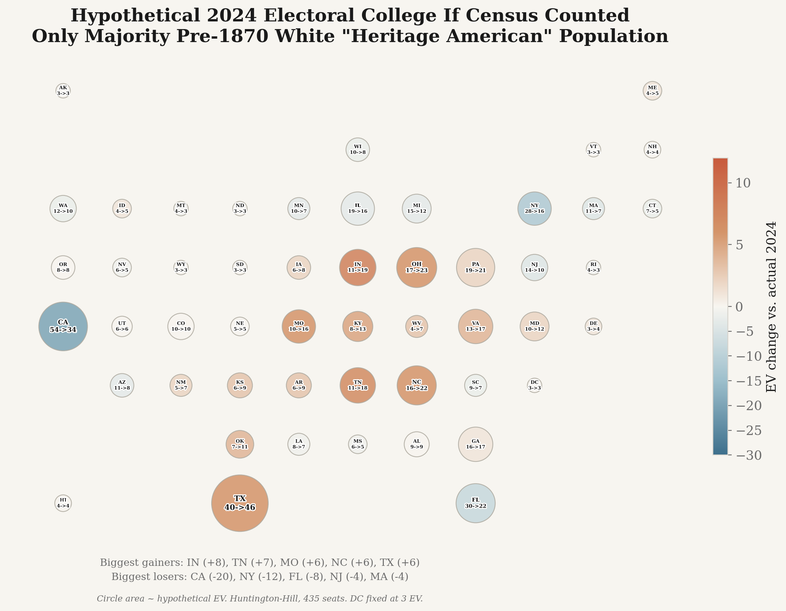

# Pre-1870 White Heritage American Ancestry Model and Electoral College Reapportionment

This package estimates what share of each U.S. state's current population descends from White residents living in the United States before 1870, then asks: **what would the Electoral College look like if the census counted only that population?**

The model is a counterfactual apportionment exercise. It does not predict how anyone would vote.

## Key outputs

### Share of U.S. population with pre-1870 White Heritage American ancestry, 1870-2020


### U.S. population by White Heritage American ancestry status


### State-level White Heritage American ancestry share (agent-based model)


### Hypothetical Electoral College reapportionment



## Two state-level models

The project implements two independent approaches to state-level estimation:

**Method A — Reduced-form model** (`state_pre1870_ancestry_model.py`): Uses ACS foreign-born and Black-alone shares with calibration to national anchors. Fast but relies on hand-set `old_stock_factor` priors per state.

**Method B — Agent-based simulation** (`state_agent_ancestry_model.py`): Runs 300K agents through 1870-2020 using historical Census data from NHGIS (population, race, and nativity by state per decade). State differences emerge from the simulation — no hand-set factors.

The notebook runs both and compares results.

## Data sources

All model inputs are loaded from CSV files in `data/`, not hardcoded:

| File | Source | Content |
|------|--------|---------|
| `national_decade_data.csv` | Census POP-WP056, DHS Yearbook, Haines, NCHS | National population, foreign-born share, TFR, LPR admissions by decade |
| `national_1870_baseline.csv` | Census POP-WP056, NHGIS 1870_cPAX | 1870 total population, Black population, foreign-born share |
| `nhgis_historical_state_panel_1790_1990.csv` | IPUMS NHGIS API extracts | State-level total, Black, AIAN, foreign-born by decade |
| `modern_census_state_race_2000_2020.csv` | Census Bureau API (dec/sf1, dec/pl) | State-level total, Black, AIAN for 2000/2010/2020 |
| `dhs_lpr_by_decade.csv` | DHS/OHSS Yearbook Table 1 | Gross LPR admissions by decade, 1820-2010 |
| `state_fips_2024_electoral_votes.csv` | National Archives | State FIPS codes and 2024 EV baseline |

## Project structure

```text
pre1870_reapportionment_package/
├── scripts/
│   ├── pre1870_ancestry_model.py          # National agent-based cohort simulation
│   ├── state_pre1870_ancestry_model.py    # State reduced-form model (Method A)
│   ├── state_agent_ancestry_model.py      # State agent-based model (Method B)
│   ├── hypothetical_ec_reapportionment.py # Electoral College reapportionment
│   ├── fetch_nhgis_state_panel.py         # NHGIS API data acquisition
│   └── ...
├── data/
│   ├── national_decade_data.csv           # National population anchors (with sources)
│   ├── national_1870_baseline.csv         # 1870 baseline values (with sources)
│   ├── nhgis_historical_state_panel_1790_1990.csv  # Historical state panel
│   ├── modern_census_state_race_2000_2020.csv      # Modern Census API data
│   ├── dhs_lpr_by_decade.csv              # Immigration admissions
│   └── geo/                               # Shapefiles for mapping
├── outputs/                               # Generated CSV and image outputs
├── notebooks/
│   └── old_stock_analysis.ipynb           # Main analysis notebook
├── fetch_pre1870_inputs.py                # Data acquisition: Census API, static inputs
├── MATH_AND_METHODS.md                    # Full mathematical specification
└── ASSUMPTIONS.md                         # Model assumptions and sensitivity
```

## Quick start

```bash
pip install -r requirements.txt
```

### 1. Fetch NHGIS historical data (requires NHGIS API key)

```bash
export NHGIS_API_KEY="your_nhgis_key"
python scripts/fetch_nhgis_state_panel.py
```

Or process an already-downloaded extract:

```bash
python scripts/fetch_nhgis_state_panel.py --from-zip nhgis_cache/nhgis_extract_2.zip nhgis_cache/nhgis_extract_3.zip
```

### 2. Fetch modern Census data (requires Census API key)

```bash
export CENSUS_API_KEY="your_census_key"
python fetch_pre1870_inputs.py --fetch-modern-census --write-static --validate
```

### 3. Run the national ancestry model

```bash
python scripts/pre1870_ancestry_model.py
python scripts/pre1870_ancestry_model.py --sensitivity
```

### 4. Run the state-level agent-based model

```bash
python scripts/state_agent_ancestry_model.py --n-agents 300000 --seeds 1870,1871,1872
```

### 5. Run the Electoral College reapportionment

```bash
python scripts/hypothetical_ec_reapportionment.py \
  --input outputs/state_agent_estimates.csv \
  --metric primary \
  --output-csv outputs/hypothetical_ec_reapportionment_primary.csv
```

### 6. Run the full analysis notebook

```bash
export CENSUS_API_KEY="your_census_key"
jupyter notebook notebooks/old_stock_analysis.ipynb
```

## Safe key handling

Do not commit API keys. Use environment variables:

```bash
export CENSUS_API_KEY="your_census_key"
export NHGIS_API_KEY="your_nhgis_key"
```

## NHGIS citation

This project uses NHGIS data. If you use these results, cite:

> Jonathan Schroeder, David Van Riper, Steven Manson, Katherine Knowles, Tracy Kugler, Finn Roberts, and Steven Ruggles. IPUMS National Historical Geographic Information System: Version 20.0 [dataset]. Minneapolis, MN: IPUMS. 2025. http://doi.org/10.18128/D050.V20.0

## Documentation

- **[MATH_AND_METHODS.md](MATH_AND_METHODS.md)** — Full mathematical specification
- **[ASSUMPTIONS.md](ASSUMPTIONS.md)** — Model assumptions and sensitivity parameters

## Dependencies

- Python 3.9+
- `numpy` — agent-based simulation
- `pandas` — data manipulation and reapportionment
- `requests` — Census and NHGIS API calls
- `matplotlib` — visualizations
- `plotly` — optional, interactive HTML map
